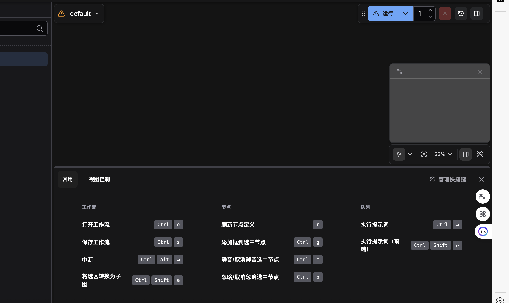
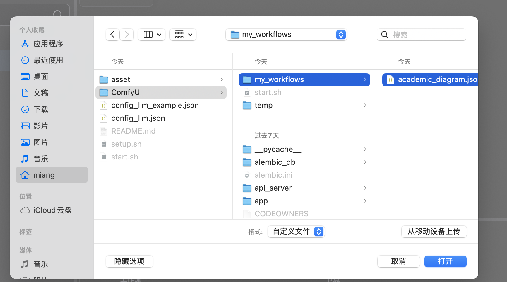

# 学术插图 AI 绘制工作流

本教程采用标准化工作流，将复杂的绘图任务拆解为「逻辑构建」与「视觉渲染」两个独立且互补的环节。通过利用 LLM 强大的逻辑推理能力来指导绘图模型的像素生成能力，产出符合 CVPR/NeurIPS 等顶刊标准的学术插图。

## 环境配置

```bash
# 1. 安装依赖
bash Draw/setup.sh

# 2. 编辑配置文件，填入 API Key
Draw/config_llm.json

# 3. 启动 ComfyUI
bash Draw/start.sh
# 访问 http://localhost:8188
```

ctrl + o 打开选择界面



选择 Draw/ComfyUI/my_workflows/academic_diagram.json




## 工作流概览

```
┌─────────────────┐    ┌─────────────────┐    ┌─────────────────┐
│  Step 1         │    │  Step 2         │    │  Step 3         │
│  The Architect  │ -> │  The Renderer   │ -> │  The Editor     │
│  逻辑构建       │    │  视觉渲染       │    │  交互式微调     │
│  (Gemini/GPT)   │    │  (Nano-Banana)  │    │  (自然语言编辑) │
└─────────────────┘    └─────────────────┘    └─────────────────┘
```
