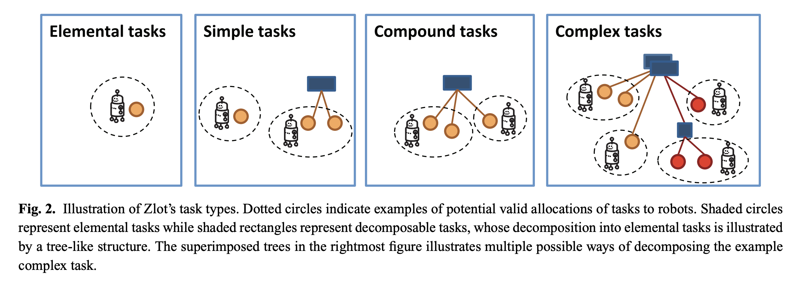

# 集群任务规划（CN）

- 主要调研关于集群机器人的任务规划算法
- 拓展了部分多学科领域（经济，生物，材料）中的集群涌现现象，可供借鉴
- 本仓库公开，欢迎将你看好的论文加入到该仓库中。
  - 参考已有的格式来加入（论文名字为5号标题）
  - 当有论文有多个链接时，建议使用arXiv的链接 或者其他的公开链接，方便所有人都轻松阅读到论文

***

***

## 目录

- **文献综述**
  - **Task Allocation**
    - A comprehensive taxonomy for multi-robot task allocation
    - A Formal Analysis and Taxonomy of Task Allocation in MultiRobot Systems
  - **Task Planning**
    - 集群协同任务规划的形式逻辑方法: 综述与展望
- **算法**
  - 

- **应用场景**
  - 
- **拓展**
  - 从蜂群到市场价格计算
- 

***

***

## 文献综述

### Task Allocation

##### A comprehensive taxonomy for multi-robot task allocation

- https://journals.sagepub.com/doi/abs/10.1177/0278364913496484

- IJRR 

- 2013

- 主旨思想

  - Fig2以任务为中心，明确了Task Types，核心问题在讨论“这个任务能分解吗？有几种分解方法？”

  

  - Fig3根据任务分配和存在的调度关系，明确了Dependency Types，核心问题在讨论“执行这个任务会如何影响其他任务的执行？”。下图中的线不仅仅表示时间依赖的先后顺序，也表示资源消耗的依赖关系。

  

  - 本文搭建了机器人任务分配（MRTA）领域与经典数学优化模型之间的桥梁，将不同复杂度的机器人问题精确地映射到成熟的数学模型上，从而帮助研究者理解问题的内在难度并借鉴已有的求解方法。

  | iTax 类别 (iTax Category)                           | 类别描述 (机器人领域)                                        | 对应的经典数学/优化模型 (数学领域)                           | 问题复杂度           |
  | :-------------------------------------------------- | :----------------------------------------------------------- | :----------------------------------------------------------- | :------------------- |
  | **无依赖 (ND)**  `No Dependencies`                  | 任务效能完全独立，分配任务时不需考虑顺序或与其他任务的协同。一个机器人执行任务A的成本/收益与它是否执行任务B无关。 | **线性求和分配问题 (Linear Sum Assignment Problem - LSAP)**   *一个经典的“一对一”指派问题，例如，将N个工人分配给N个任务以实现总成本最低。* | **P**                |
  | **计划内依赖 (ID)**   `In-Schedule Dependencies`    | 任务效能依赖于**同一个机器人**任务计划中的其他任务。最典型的例子是路径规划，任务执行的顺序会影响总成本（路程）。 | **多旅行商问题 (m-TSP)** **车辆路径问题 (VRP)** **广义分配问题 (GAP)** **机器调度问题 (Machine Scheduling)** *这些模型的核心是为单个代理（机器人）找到一个最优的任务序列或集合。* | **NP-hard**          |
  | **跨计划依赖 (XD)**   `Cross-Schedule Dependencies` | 任务效能依赖于**不同机器人**的任务计划。这通常由机器人间的协同、约束或资源共享引起（例如，任务A必须在任务B之前完成，但它们由不同机器人执行）。 | **集合划分问题 (Set Partitioning Problem)** (用于无重叠的联盟形成) **集合覆盖问题 (Set Covering Problem)** (用于有重叠的联盟形成) **带旁路/同步约束的VRP/调度问题** *这些模型处理的是多个代理计划之间的耦合和约束。* | **NP-hard**          |
  | **复杂依赖 (CD)**   `Complex Dependencies`          | 任务本身存在**多种有效的分解方式**，系统必须在分配任务的同时决定采用哪种分解方案。这是任务分解、分配和调度三个问题的完全耦合。 | **(无直接对应的成熟模型)**  目前还没有一个广为人知的标准模型能够完全捕捉这类问题的复杂性。这代表了该领域的一个前沿研究方向。 | **NP-hard**   (至少) |
  

- 生动形象的案例

> ### 场景设定：失落群岛的寻宝任务
>
> - **探险队**：我们有两名勇敢的机器人探险家，**R1** 和 **R2**。
> - **大本营 (Base)**：所有探险的起点和终点，位于群岛的南端。
> - **宝藏**：岛上有四个失落的宝藏，分别位于不同的地点：
>   - **A**: 古代钱币 (在西边的瀑布后)
>   - **B**: 宝石高脚杯 (在东边的火山坑旁)
>   - **C**: 水晶头骨 (在西边的神庙里，离 A 很近)
>   - **D**: 黄金罗盘 (在东边的沉船里，离 B 很近)
> - **目标**：以最少的总耗能（即最短的总路程）将所有四个宝藏带回大本营。
>
> 
>
> ### 案例一：无依赖 (No Dependencies - ND) 的寻宝规则
>
> 在这个版本的任务中，我们有一条**非常重要的规则**。
>
> #### 📜 **核心规则**
>
> > 每个机器人的货舱很小，一次只能携带一件宝藏。因此，每当机器人找到一件宝藏后，**必须立刻返回大本营 (Base)** 卸货，然后才能出发去寻找下一个宝藏。
>
> 1. **任务分配的思考方式**：
>    现在，指挥中心需要决定由谁去拿哪个宝藏。让我们来分析一下寻找“古代钱币 (A)”的任务。
>    - 
>    - 如果让 **R1** 去拿，它的成本是固定的：**路程(Base → A → Base)**。
>    - 如果让 **R2** 去拿，它的成本也是固定的：**路程(Base → A → Base)**。
> 2. **“无依赖”的体现**：
>    **R1** 执行任务 A 的成本，与它将来是否要去拿任务 B、C 或 D **完全没有关系**。因为每次任务都是一次独立的“往返旅行”。同理，分配任务 A 给谁的决定，也完全不影响分配任务 B 给谁的决定。它们是四个**完全独立**的决策。
> 3. **如何解决问题**：
>    解决这个问题非常简单。我们只需要对每一个宝藏进行一次计算：
>    - **宝藏 A**：谁离 A 更近？让谁去。
>    - **宝藏 B**：谁离 B 更近？让谁去。
>    - **宝藏 C**：谁离 C 更近？让谁去。
>    - **宝藏 D**：谁离 D 更近？让谁去。
>      这就是一个**线性分配问题 (LSAP)**。
> 4. **最终计划**：
>    - **R1 的任务列表**：[取回 A, 取回 C] （R1 执行 A 和 C 的顺序不影响总成本，因为都是独立往返）
>    - **R2 的任务列表**：[取回 B, 取回 D]
>
> 
>
> ### 案例二：计划内依赖 (In-Schedule Dependencies - ID) 的寻宝规则
>
> 现在，我们给机器人**升级装备**，规则也随之改变。
>
> #### 📜 **核心规则**
>
> > 每个机器人都装备了一个大容量的“探险背包”，可以**一次携带多件宝藏**。机器人可以规划一条连续的路线，访问多个藏宝点，最后再返回大本营。
>
> 1. **任务分配的思考方式**：
>    这个规则的改变，让问题变得复杂得多。我们再来分析分配任务。假设我们初步决定让 **R1** 去拿“古代钱币 (A)”和“水晶头骨 (C)”。
>    - **R1** 现在不需要跑两次往返了。它可以规划一条最优路线：**路程(Base → A → C → Base)**。
>    - 现在，获取宝藏 C 的**边际成本** (marginal cost) 不再是 Base → C → Base 的距离，而仅仅是 A → C 的距离！
> 2. **“计划内依赖”的体现**：
>    这就是“计划内依赖”的核心！
>    - 一个任务的成本（或效用）**依赖于同一个机器人计划内的其他任务**。
>    - 获取宝藏 C 的成本，取决于 **R1** 的上一站是哪里。
>    - 任务的**执行顺序**也变得至关重要。路线 Base → A → C → Base 和 Base → C → A → Base 的总路程可能是不同的。
>    - 但是请注意，**R1** 的计划和 **R2** 的计划之间仍然是**相互独立**的。**R1** 怎么规划它的路线，并不会影响 **R2** 如何规划它的路线。
> 3. **如何解决问题**：
>    我们不能再简单地把最近的宝藏分配给机器人了。因为 A 和 C 靠得很近，把它们打包分配给同一个机器人可能会产生巨大的“协同效应”，即使其中一个宝藏离另一个机器人更近。
>    我们需要解决一个更复杂的问题，类似于**多旅行商问题 (m-TSP)**：
>    - 如何将这 4 个宝藏分成两组？
>    - 对于每一组，如何规划出最短的寻宝路线（旅行商问题）？
>    - 哪种分组方式能让两条路线的总长度之和最小？
> 4. **最终计划的样子**：
>    最终的计划不再是简单的任务列表，而是两条**最优的路径（或调度）**：
>    - **R1 的计划**：“从大本营出发，先去 A，然后去 C，最后返回大本营。”
>    - **R2 的计划**：“从大本营出发，先去 B，然后去 D，最后返回大本营。”
>
> 
>
> ### 案例三：跨计划依赖 (Cross-Schedule Dependencies - XD) 的寻宝规则
>
> 寻宝任务变得更加危险和复杂，出现了需要机器人**协同配合**才能解决的机关。
>
> #### 📜 **核心规则**
>
> > 1. **新宝藏**: 岛屿中央的山洞里发现了第五件宝藏——**“山之心” (E)**。
> > 2. **机关联动**: 山洞的石门 (E点) 是紧锁的。要打开它，必须有人在东边的火山坑 (B点) **拉下一个古老的杠杆**。这个杠杆一旦拉下，石门只会开启很短的一段时间。
> > 3. **重量限制**: “山之心” (E) 太重了，**必须由两个机器人合力**才能搬运回大本营。
>
> 1. **任务分配的思考方式**：
>    现在，机器人的计划不再是独立的了。让我们分析一下新情况：
>    - **因果链条**: 任何一个机器人想要进入山洞 (E) 拿宝藏，都**依赖于**另一个机器人先去火山 (B) 拉下杠杆。这就形成了一个**跨越机器人计划的先后顺序约束 (Precedence Constraint)**：任务B的完成 必须先于 任务E的进入。
>    - **强制合作**: 搬运“山之心”(E) 这个任务本身就是一个**多机器人任务 (Multi-Robot Task)**。它不能被分配给单个机器人，必须分配给一个由 R1 和 R2 组成的“联盟”。
> 2. **“跨计划依赖”的体现**：
>    - **R1 的最优路线**现在直接受到 **R2 计划**的影响（反之亦然）。
>    - 假设 **R2** 被分配了去拉杠杆 (任务B)。它不能随时去，它必须计算好时间，确保当它拉下杠杆时，**R1** 已经等在山洞门口了，否则就是白费力气。
>    - 同时，在规划完各自前序任务后，**R1 和 R2 都必须在山洞 (E) 汇合**，一起执行搬运任务，然后再一起返回大本-营。
>    - 在 **ID** 案例中，我们只需要分别优化两条独立的路线。但现在，这两条路线被各种依赖关系**“捆绑”**在了一起，必须作为一个**整体**来联合优化。
> 3. **如何解决问题**：
>    问题变得非常棘手。指挥中心必须解决一个**带复杂约束的联合调度问题**。它需要同时回答：
>    - 谁去拉杠杆(B)，谁先去洞口等(E)？
>    - 他们各自前面的寻宝路线 (A, C, D) 应该如何规划，才能确保他们在正确的时间点执行 B 和 E 的联动任务？
>    - 如何最小化整个团队的总耗时或总路程？
> 4. **最终计划的样子**：
>    最终的计划是一份高度同步和协调的**团队行动方案**：
>    - **R1 的计划**: “先去 C 拿头骨，然后前往 E 等待。等石门开启后，与 R2 一起搬运 E 回大本营。”
>    - **R2 的计划**: “先去 D 拿罗盘，然后去 B 拉下杠杆，并立即赶往 E 与 R1 汇合，共同搬运 E 回大本营。”
>
> 
>
> ### 案例四：复杂依赖 (Complex Dependencies - CD) 的寻宝规则
>
> 在最终的挑战中，机器人团队发现，完成协同任务的方法不止一种，不同的方法会带来完全不同的依赖关系网络。
>
> #### 📜 **核心规则**
>
> > 获取宝藏E的基本前提不变（需两人合力搬运），但关于如何打开山洞的石门，探险队在一本古老的日志中发现了**两种截然不同的协议**。团队必须根据情况**选择其中一种**来执行。
> >
> > **协议一：“杠杆接力” (Decomposition 1 - The Lever Protocol)**
> >
> > - **描述**：这正是案例三（XD）中的方法。一个机器人前往B点拉下杠杆（子任务B），另一个机器人必须在石门开启的时间窗口内于E点等候并进入（子任务E-enter）。
> > - **依赖类型**：**先后顺序依赖 (Precedence)**。这个协议对时间的要求是“先……后……”，允许一定的容错窗口。
> >
> > **协议二：“符文共鸣” (Decomposition 2 - The Harmony Protocol)**
> >
> > - **描述**：在岛屿西侧的A点和东侧的D点各有一个古老的符文石。如果两个机器人**在完全相同的时刻**用手触碰这两个符文石，山洞的石门会永久性地打开。
> > - **依赖类型**：**精确同步依赖 (Synchronization)**。这个协议对时间的要求是“在同一时刻”，约束极为严格，没有容错。
>
> 1. **任务分配的思考方式**：
>    现在，指挥中心面临的不再仅仅是“如何协同”，而是“应该选择哪一种协同方式”的战略抉择。这个选择会从根本上改变整个任务的约束结构。
>    - **分解选择**: “打开石门”这个高阶任务，现在有了两种截然不同的子任务分解方案（“杠杆接力”方案 vs. “符文共鸣”方案）。
>    - **战略依赖**: 最佳协议的选择并不是孤立的，它完全取决于分配给两个机器人的其他任务（A, B, C, D）所形成的最优路径。选择哪种协议，会反过来影响其他任务的最佳分配和执行顺序。
> 2. **“复杂依赖”的体现**：
>    - **任务分解的不确定性**: 问题的核心在于，任务的内在结构（即应该执行哪些子任务）本身是未知的，是待求解的变量之一。
>    - **分解与调度的深度耦合**: 无法在规划路径之前，独立地判断哪种协议更好。如果机器人的最优路径恰好能让它们自然地在同一时间点分别到达A和D，那么“符文共鸣”协议的成本就极低。反之，如果同步的代价是巨大的绕路，那么选择成本相对固定的“杠杆接力”协议可能更为明智。
>    - 整个问题从求解一个**固定的依赖网络**（XD），升级为在一个**包含多种可选依赖网络的集合**中寻找最优解。
> 3. **如何解决问题**：
>    问题变得极度复杂。指挥中心必须在一个包含了“协议选择”这个额外维度的、更庞大的空间里进行搜索。它需要同时回答：
>    - 团队应该采用哪一种任务分解方案（“杠杆接力”还是“符文共鸣”）？
>    - 在选定的方案下，分解出的子任务（如去A、B或D）应该分配给谁？
>    - 每个机器人的完整最优路径和时间表是什么？
>      这三个问题紧密耦合，必须通过评估不同分解方案下的全局最优解来协同求解。
> 4. **最终计划的样子**：
>    最终的计划是一套包含了顶层战略决策的完整团队行动方案，它明确了选择哪条路走。
>    - **可能的最终计划**: “最终决定：采用‘符文共鸣’协议。R1的路径为Base→C→A，R2的路径为Base→B→D，两者须在14:52分整同步触碰符文石。之后共同前往E点汇合，搬运宝藏E并返回大本营。”

***

##### A Formal Analysis and Taxonomy of Task Allocation in MultiRobot Systems

- https://journals.sagepub.com/doi/10.1177/0278364904045564

- IJRR 

- 2004

  

***

##### A Survey on Large Language Model-Based Game Agents

- https://arxiv.org/pdf/2404.02039
- 2024.4

***

##### A Systematic Literature Review on Multi-Robot Task Allocation

- https://www.researchgate.net/profile/Umashankar-Subramaniam/publication/384920503_A_Systematic_Literature_Review_on_Multi-Robot_Task_Allocation/links/671229f5035917754c07914d/A-Systematic-Literature-Review-on-Multi-Robot-Task-Allocation.pdf
- ACM Computing Survey 
- 2024

***

##### Optimization techniques for Multi-Robot Task Allocation problems: Review on the state-of-the-art

- https://www.researchgate.net/profile/Hamza-Chakraa/publication/372587435_Optimization_techniques_for_Multi-Robot_Task_Allocation_problems_Review_on_the_state-of-the-art/links/67b5a6b48311ce680c69c5b9/Optimization-techniques-for-Multi-Robot-Task-Allocation-problems-Review-on-the-state-of-the-art.pdf
- Robot. Auton. Syst
- 2023.10

***

##### Multi-robot Task Allocation: A Review of the State-of-the-Art

- https://www.researchgate.net/profile/Ahmed-Elmogy/publication/277075091_Multi-robot_Task_Allocation_A_Review_of_the_State-of-the-Art/links/60257382a6fdcc37a81d3e1d/Multi-robot-Task-Allocation-A-Review-of-the-State-of-the-Art.pdf
- Cooperative Robots and Sensor Networks
- 2015

***

##### Market Approaches to the Multi-Robot Task Allocation Problem: a Survey

- https://link.springer.com/article/10.1007/s10846-022-01803-0
- J. Intell. Robot. Syst
- 2023.2

***

### Task Planning

##### 集群协同任务规划的形式逻辑方法: 综述与展望

- https://www.aas.net.cn/cn/article/doi/10.16383/j.aas.c250223

- 自动化学报
- 2025
- 本文侧重于无人集群基于形式逻辑的复杂任务规划方法
- 约束优化问题
  - 侧重数值优化
  - 通过实数与整数变量直接构建任务的目标函数, 常包括最小化任务总完成时间、最大化资源利用率或降低集群资源能耗
  - 多车路径规划问题、车间调度问题，已有成熟的建模模板和规划框架,  可在工业制造、智能仓储、物流调度等场景中直接部署
  - 程序：Gurobi、CPLEX等商用优化器
  - 缺点：变量维数高、约束复杂等因素容易引发“维数灾难”，导致求解时间剧增、实时性下降；在动态不确定与大规模协同场景中, 其适应性受限（环境与任务扰动导致模型频繁重构并重求｜ 二进制变量与时域离散化致使维度随智能体、任务与时间步呈组合性增长, 使得求解与内存开销暴涨）
  - 优势：在严谨性和可解释性方面具有显著优势,
- 任务描述语言
  - ***符号主义人工智能的推理思想***
  - 强调结构表达
  - 通过环境变量刻画系统状态，并定义各类动作的前置条件与执行效果, 将任务建模为状态集合上的转换过程.
  - 任务目标通常转化为在状态空间中搜索一条满足所有动作定义的最短动作序列
  - STRIPS(Stanford research institute problem solver)，HTN(Hierarchical task network)，PDDL(Planning domain definition language)
  - 缺点：面对具有连续变量、时空耦合约束或高度不确定性的复杂场景时, 其表达能力、抽象层级及人工建模效率往往难以满足需求
- 时序逻辑语言
  - 优点：处理复杂依赖、持续性约束与安全攸关任务，在动态环境下具备较强适应性, 支持任务规范的在线调整与局部更新, 适用于需求频繁变化的任务系统.
  - 缺点：在大规模系统与实时响应任务中状态空间爆炸、计算开销大
  - 线性时序逻辑、度量时序逻辑、信号时序逻辑、计算树逻辑
  - 应用：路径规划、协同控制
- 基于LLM的自然语言
  - 优点：语言理解能力，泛化能力，降低了专业性，
  - 缺点：准确性、可解释性与形式化验证
  - 摆脱传统建模框架对人工建模与结构化输入的依赖

***

***

## 算法论文

##### Air-Ground Collaboration for Language-Specified Missions in Unknown Environments

- https://arxiv.org/pdf/2505.09108
- IEEE TFR
- 2025.5

***

##### BeeCluster: Drone Orchestration via Predictive Optimization

- https://people.csail.mit.edu/songtao/BeeCluster.pdf
- 2020

***

##### APEX-MR: Multi-Robot Asynchronous Planning and Execution for Cooperative Assembly

- https://arxiv.org/pdf/2503.15836
- RSS
- 2025.3

***

##### CityNavAgent: Aerial Vision-and-Language Navigation with Hierarchical Semantic Planning and Global Memory

- https://arxiv.org/pdf/2505.05622

***

##### Compositional Coordination for Multi-Robot Teams with Large Language Models

- https://arxiv.org/pdf/2507.16068
- homepage：https://sites.google.com/view/lan-cb?pli=1
- 

***

##### SMART-LLM: Smart Multi-Agent Robot Task Planning using Large Language Models

- https://arxiv.org/pdf/2309.10062
- IEEE IROS
- 2024.10

***

##### LiP-LLM: Integrating Linear Programming and Dependency Graph With Large Language Models for Multi-Robot Task Planning

- https://arxiv.org/pdf/2410.21040
- IEEE RAL
- 2025.2

***

##### LLM-drone: aerial additive manufacturing with drones planned using large language models

- https://link.springer.com/article/10.1007/s41693-025-00162-0
- Construction Robotics
- 2025

***

##### Long-Horizon Planning for Multi-Agent Robots in Partially Observable Environments

- https://proceedings.neurips.cc/paper_files/paper/2024/file/7d6e85e88495104442af94c98e899659-Paper-Conference.pdf
- NIPS
- 2024

***

##### Heterogeneous Multi-robot Task Allocation and Scheduling via Reinforcement Learning

- https://ieeexplore.ieee.org/abstract/document/10854527
- IEEE RAL
- 2025.3

***

##### RoboBallet: Planning for Multi-Robot Reaching with Graph Neural Networks and Reinforcement Learning

- https://arxiv.org/pdf/2509.05397
- Science Robotics
- 2025.9

***

##### SwarmBrain: Embodied agent for real-time strategy game StarCraft II via large language models

- https://arxiv.org/pdf/2401.17749
- 2024.1

***

##### VillagerAgent: A Graph-Based Multi-Agent Framework for Coordinating Complex Task Dependencies in Minecraf

- https://arxiv.org/pdf/2406.05720
- 2024.6

***

***

## 拓展

##### 从蜂群到市场价格计算

- https://www.youtube.com/watch?v=rb_Mh1vAUx0

##### Scaling Behavior in the Dynamics of an Economic Index

- https://www.researchgate.net/publication/243772362_Scaling_Behavior_in_the_Dynamics_of_an_Economic_Index

***

***

## 实验

- ConwayLife生命游戏：https://conwaylife.com/
- Lenia： https://github.com/Chakazul/Lenia
- Particle Life: https://particle-life.com/